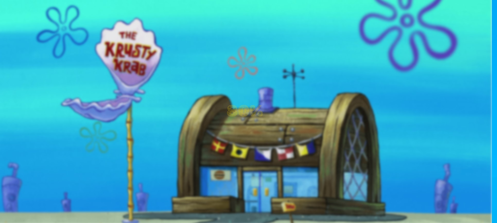

# Background Image Loading Progress 

This project demonstrates a simple loading progress bar with a background image blur effect using HTML, CSS, and JavaScript.

## Features

- Displays a background image with a loading progress bar indicating the percentage of completion.
- The background image blurs gradually as the loading progresses.
- Utilizes CSS for styling and JavaScript for controlling the loading animation.

## Usage

1. Open the `index.html` file in a web browser.
2. The loading progress bar will start from 0% and gradually increase until it reaches 100%.

## Files

- `index.html`: HTML file defining the page structure and elements.
- `style.css`: CSS file defining the styles for the page and loading animation.
- `app.js`: JavaScript file controlling the loading progress and blur effect.

## Additional Information

- The project uses the Google Fonts API to import the 'Rubik Moonrocks' font.
- The background image is loaded from the `./img/6549944.png` path.

## How it Works

- The loading progress is calculated using a JavaScript function that updates the loading percentage and adjusts the blur effect of the background image accordingly.

## Live Demo

Check out the live demo [here](https://youtube-al-ma-5.vercel.app/).

## License

This project is licensed under the MIT License. See the [LICENSE](LICENSE) file for more information.
